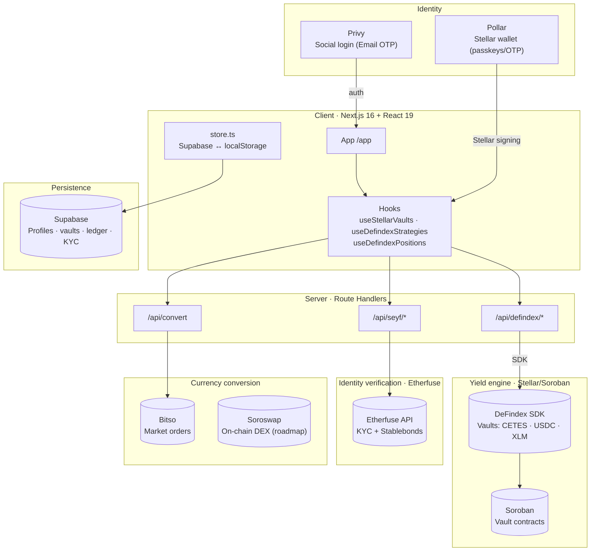

<div align="center">

# SEYF

### The savings & investment super app on Stellar

Real-yield vaults (CETES, USDC, XLM) · Integrated KYC · SPEI on-ramp · Embedded wallet with no seed phrase
Built on **Stellar/Soroban**, **DeFindex**, **Etherfuse**, **Pollar**, and **Soroswap**.

<br/>


</div>

---

## What is SEYF

**SEYF** is a mobile-first savings and investment platform for Mexico. It combines the simplicity of a neobank (SPEI deposits, peso balances, plain-language UX) with real on-chain DeFi yield on Stellar that users never have to think about.

### The problem

Mexico's mandatory pension system (AFORE) leaves most workers under-covered:
- **~30% replacement rate** at retirement.
- **~57% labor informality** — gig workers often have no retirement savings at all.
- **Low real returns and poor transparency** in traditional instruments.

SEYF targets Mexicans aged 25–55 who want a **voluntary, transparent, liquid** alternative.

### What we built

A single Next.js application with three layers:

1. **Neobank UX**
   Email login (Privy) → embedded Stellar wallet (Pollar, passkeys/OTP) → no seed phrase → SPEI on/off-ramp.

2. **Real-yield vaults on Stellar (DeFindex)**
   Users deposit into Soroban-based DeFindex vaults. Three strategies: CETES (~10.5% APY), USDC (~4.5%), XLM (~2.8%). Balance and yield are verifiable on-chain.

3. **Identity & sovereign bonds (Etherfuse)**
   In-app KYC flow (CURP, INE, selfie) via Etherfuse. Access to tokenized Mexican government bonds (CETES) on Stellar.

4. **FX conversion (Bitso → Soroswap)**
   MXN ↔ USD/EUR/BRL via Bitso market orders today. Soroswap (Stellar DEX) integration on roadmap for on-chain swaps.

---

## Architecture



---

## DeFindex Strategies (Testnet)

| Strategy | Plan | Vault Address | Asset | Target APY | Risk |
|----------|------|---------------|-------|------------|------|
| **CETES** | Conservative | `CBIS5TEM...NLF2P` | CETES (7 dec) | ~10.5% | Low |
| **USDC** | Moderate | `CBMVK2JK...DWHN` | USDC (7 dec) | ~4.5% | Low |
| **XLM** | Balanced | `CCLV4H7W...GFSF6` | XLM (7 dec) | ~2.8% | Medium |

DeFindex Factory: `CDSCWE4GLNBYYTES2OCYDFQA2LLY4RBIAX6ZI32VSUXD7GO6HRPO4A32`

---

## Core User Flows

| Flow | What happens |
|------|--------------|
| **Onboard** | Email OTP (Privy) → Pollar OTP → Stellar wallet created → profile synced to Supabase |
| **Deposit to vault** | Choose strategy → `/api/defindex/deposit` builds XDR → Pollar signs → confirmed on Stellar |
| **Withdraw** | Same pattern via `/api/defindex/withdraw` → signed → balance updated |
| **KYC** | In-app identity flow → documents → Etherfuse verifies → status persisted |
| **FX convert** | MXNB to treasury → Bitso market order → ledger credited |

---

## Tech Stack

| Layer | Technology | Role |
|-------|-----------|------|
| **Framework** | Next.js 16, React 19, TypeScript 5 | UI + API routes |
| **Blockchain** | Stellar (Soroban) | Where funds live |
| **Yield** | [DeFindex](https://defindex.io) | Vault infrastructure |
| **DEX** | [Soroswap](https://soroswap.finance) | On-chain swaps (roadmap) |
| **Wallet** | [Pollar](https://pollar.xyz) | Embedded Stellar wallet |
| **Auth** | [Privy](https://privy.io) | Social login |
| **KYC + Bonds** | [Etherfuse](https://etherfuse.com) | Identity + sovereign bonds |
| **Fiat rails** | SPEI (Juno / Dynerox) | On/off-ramp |
| **FX** | Bitso API | Currency conversion |
| **Database** | Supabase (Postgres) | Profiles, ledger, vaults, KYC |

---

## Quick Start

```bash
cp .env.example .env.local
npm install
npm run dev    # http://localhost:3000
```

**Required for testnet:**
1. DeFindex API key (`api.defindex.io`)
2. Pollar API key (`dashboard.pollar.xyz`, testnet mode)
3. Privy app with Email login enabled
4. Supabase project (URL + service_role key)

---

## Security

- **Server-only secrets** — DeFindex, Etherfuse, Bitso, Supabase service_role keys never reach the client.
- **User-signed transactions** — Every Stellar tx requires OTP or passkey via Pollar.
- **Idempotency** — FX conversions and ramp orders use unique keys.
- **Webhook verification** — Etherfuse webhook signatures validated.
- **No seed phrase** — Keys managed by Pollar (device passkeys).

---

## Roadmap

| Priority | Feature | Detail |
|:--------:|---------|--------|
| 🔴 | **Mainnet launch** | DeFindex vaults on pubnet, Pollar mainnet, Etherfuse production |
| 🔴 | **Soroswap integration** | On-chain MXN↔USDC↔XLM swaps replacing Bitso for Stellar pairs |
| 🟡 | **Revenue model** | FX spread + vault performance fee (DeFindex fee_receiver) |
| 🟡 | **Direct on-ramp** | SPEI → vault in one step (Dynerox → Stellar → DeFindex) |
| 🟡 | **Blend lending** | 0% liquidity advance against vault position |
| 🟢 | **Audit** | Smart contract audit before mainnet with real funds |
| 🟢 | **Multi-country** | Expansion to Colombia / Argentina |

---

## Business Model

| Revenue stream | Mechanism | Status |
|----------------|-----------|--------|
| **FX spread** | Markup on currency conversions (pool drift = revenue) | Planned |
| **Vault performance fee** | % of yield via DeFindex fee_receiver | Planned |
| **On-ramp fee** | Small % on SPEI deposits | Planned |

Not a token project. SEYF is the UX and orchestration layer over existing Stellar protocols.

---

<div align="center">
<br/>

Built on **Stellar** · DeFindex · Soroswap · Etherfuse · Pollar · Supabase

</div>
