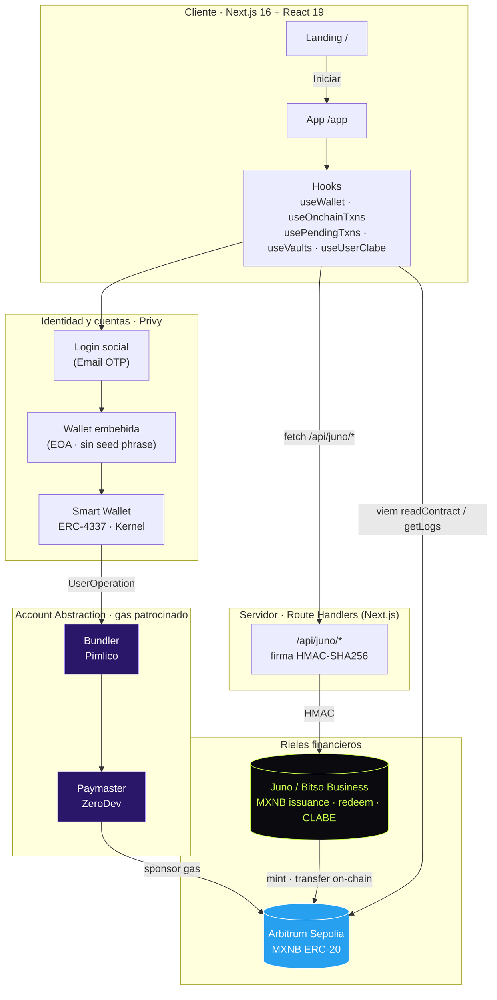
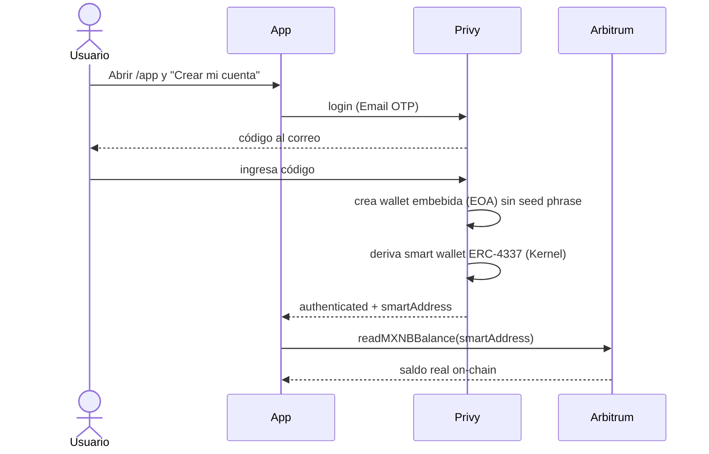
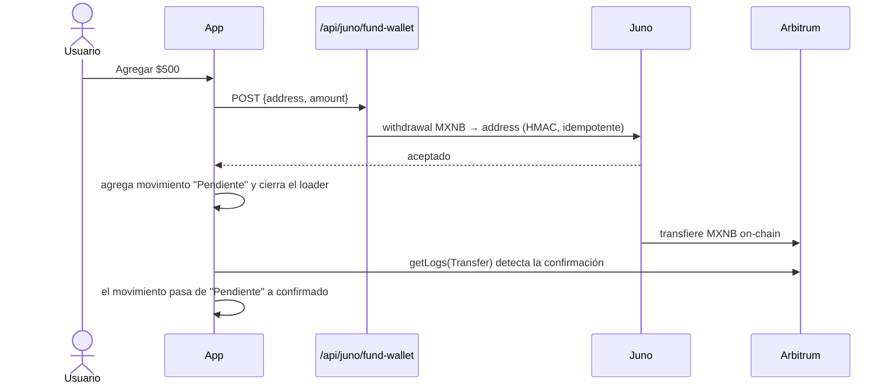
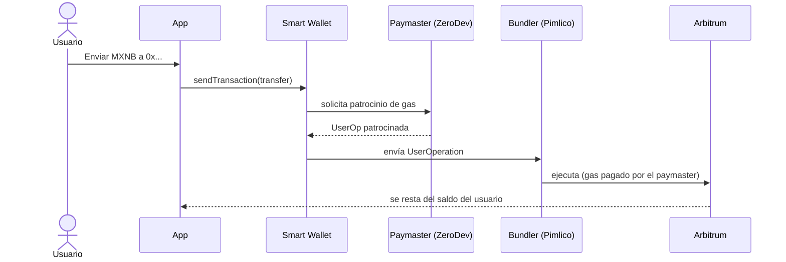
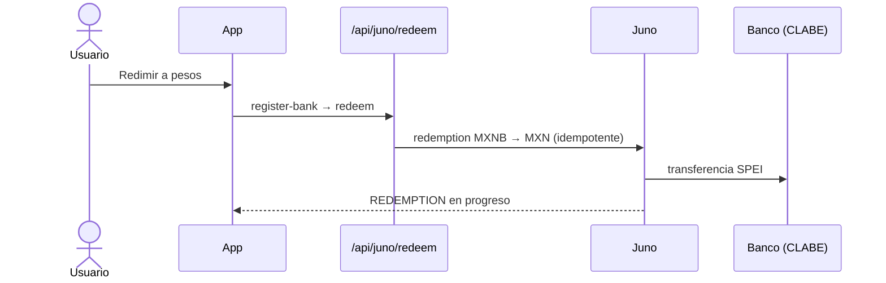
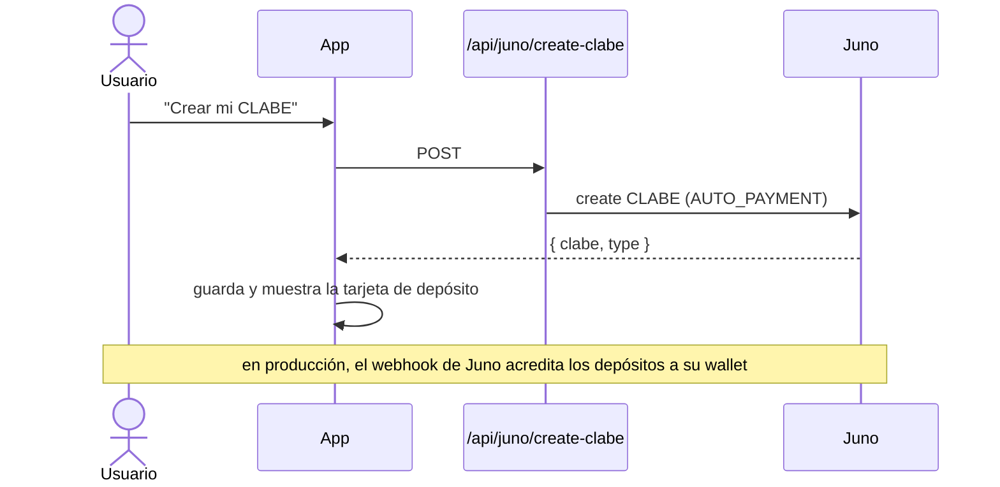

<div align="center">

# Reyf

### La super app de finanzas para ahorrar, invertir y gastar sin fronteras

Pesos digitales que rinden · Bonos de gobierno de 4 países · Bóvedas de ahorro · Tarjeta multi-divisa
Construida sobre **MXNB** (Bitso Business / Juno), wallets sociales sin seed phrase y transacciones con gas patrocinado.

<br/>


</div>

---

## Capturas

<div align="center">

| Inicio | Invertir | Landing |
|:------:|:--------:|:-------:|
|  |  |  |

</div>

> Las imágenes viven en [`docs/screenshots/`](docs/screenshots). Coloca ahí `home.png`, `bonds.png` y `landing.png`.

---

## Tabla de contenidos

- [Qué es Reyf](#qué-es-reyf)
- [Tecnologías](#tecnologías)
- [Arquitectura](#arquitectura)
- [Flujos](#flujos)
- [Funcionalidades](#funcionalidades)
- [API (endpoints)](#api-endpoints)
- [Rutas](#rutas)
- [Configuración (Juno · Privy · ZeroDev)](#configuración-juno--privy--zerodev)
- [Variables de entorno](#variables-de-entorno)
- [Arranque](#arranque)
- [Estructura](#estructura)
- [Seguridad](#seguridad)
- [Roadmap](#roadmap)

---

## Qué es Reyf

Reyf es una wallet de finanzas personales que une tres mundos en una sola app:

| | |
|---|---|
| **Fiat ↔ Cripto sin fricción** | Depósitos y retiros (SPEI) se convierten a **MXNB** (stablecoin MXN) vía **Bitso Business / Juno**. |
| **Onboarding sin seed phrase** | El usuario entra con **correo** y obtiene una **smart wallet** en Arbitrum, sin extensiones ni frases semilla. |
| **Sin gas, sin firmas** | Las transacciones on-chain del usuario son **patrocinadas** (account abstraction ERC-4337 + paymaster). |

Cada usuario tiene **saldo real on-chain**, **historial real** (transferencias MXNB) y su **CLABE de depósito** propia. Diseño dark glassmorphism, responsive (móvil y escritorio).

---

## Tecnologías

| Capa | Tecnología | Rol |
|------|-----------|-----|
| **Framework** | Next.js 16 (App Router, Turbopack) · React 19 · TypeScript 5 | UI + API routes en un solo proyecto |
| **Estilos** | Tailwind v4 + design tokens (CSS vars) | Tema dark glassmorphism (lima/violeta) |
| **Identidad / wallets** | [Privy](https://privy.io) (`@privy-io/react-auth`) | Login social (Email OTP) + wallet embebida (EOA) sin seed phrase |
| **Account abstraction** | ERC-4337 · Kernel (smart account) | La wallet del usuario es una cuenta inteligente |
| **Paymaster (gas)** | [ZeroDev](https://zerodev.app) | Patrocina el gas de las transacciones del usuario |
| **Bundler** | [Pimlico](https://pimlico.io) | Empaqueta y envía las UserOperations |
| **On-chain** | [viem](https://viem.sh) · `permissionless` | Lectura de saldo/eventos ERC-20 y transfers |
| **Rieles fiat** | [Juno / Bitso Business](https://docs.bitso.com/juno) | Issuance/redeem de **MXNB**, CLABEs, SPEI (HMAC-SHA256) |
| **Persistencia** | [Supabase](https://supabase.com) (Postgres) | Perfiles, CLABEs, cuentas, bóvedas y bono por usuario |
| **Red / activo** | Arbitrum Sepolia · **MXNB** (ERC-20, 6 decimales) | Donde vive y se mueve el dinero del usuario |

---

## Arquitectura



**Principios de diseño**

- Los **secretos de Juno viven solo en el servidor** (los route handlers firman HMAC). El frontend nunca firma ni ve credenciales.
- El **saldo por usuario** se lee on-chain de su smart wallet (no del balance de negocio de Juno).
- El **gas** lo paga el paymaster de ZeroDev: el usuario no firma popups ni paga comisiones de red.

---

## Flujos

### Onboarding + smart wallet (sin seed phrase)



### Depósito (fondear la wallet del usuario) con UI optimista



### Envío on-chain gasless (account abstraction)



### Redención (MXNB → MXN por SPEI)



### CLABE de depósito por usuario



---

## Funcionalidades

| Módulo | Descripción | Estado |
|--------|-------------|:------:|
| Landing | Hero animado, contadores, marquee, bento, FAQ, tilt 3D — CTA Iniciar → /app | Listo |
| Login social (Privy) | Email OTP, wallet embebida sin seed phrase | Listo |
| Account abstraction | Smart wallet ERC-4337 (Kernel) + paymaster (ZeroDev) + bundler (Pimlico) | Listo |
| Saldo on-chain real | Lectura de MXNB (ERC-20) de la wallet del usuario (viem) | Listo |
| Agregar (depósito) | Fondea la wallet del usuario con MXNB; UI optimista (pendiente → confirmado) | Listo |
| Enviar | Transferencia MXNB on-chain gasless; se resta del saldo del usuario | Listo* |
| Historial | Transferencias MXNB reales on-chain + pendientes (viem getLogs) | Listo |
| CLABE de depósito | CLABE única por usuario + tarjeta de depósito (SPEI → MXNB) | Listo |
| Redeem | MXNB → MXN por SPEI a una CLABE registrada | Listo |
| Bóvedas | Metas de ahorro reales por usuario (crear/abonar/retirar) | Listo |
| Convertir | Calculadora multi-activo + acción real para el par MXNB ↔ MXN | Listo |
| Bono de bienvenida | 1,500 MXNB on-chain a usuarios nuevos (testnet) | Listo |

\* El envío gasless requiere una política de patrocinio activa en ZeroDev (ver [Configuración](#configuración-juno--privy--zerodev)).

---

## API (endpoints)

Todos bajo `/api/juno/*` (route handlers server-side, firma HMAC-SHA256).

| Método | Ruta | Función |
|:------:|------|---------|
| `GET`  | `/api/juno/health` | Estado + si hay credenciales |
| `GET`  | `/api/juno/account-details` | CLABEs de depósito del negocio |
| `POST` | `/api/juno/create-clabe` | Crear CLABE única (por usuario) |
| `POST` | `/api/juno/mock-deposit` | Issuance (SPEI test → MXNB al negocio) |
| `POST` | `/api/juno/fund-wallet` | Enviar MXNB on-chain a la wallet del usuario (depósito) |
| `GET`  | `/api/juno/balance` | Balances del negocio (MXNB) |
| `GET`  | `/api/juno/transactions` | Historial del negocio |
| `GET`  | `/api/juno/bank-accounts` | Cuentas registradas |
| `POST` | `/api/juno/register-bank` | Registrar CLABE destino |
| `POST` | `/api/juno/redeem` | Redemption (MXNB → MXN) |
| `POST` | `/api/juno/withdrawal` | Retiro on-chain de MXNB |
| `POST` | `/api/juno/welcome-bonus` | Bono de bienvenida (1,500 MXNB) |
| `POST` | `/api/juno/webhook` | Eventos async (firma verificada) |

---

## Rutas

| Ruta | Pantalla |
|------|----------|
| `/` | Landing — primera pantalla, CTA Iniciar / Iniciar ahora → /app |
| `/app` | App — onboarding (login) → Inicio · Wallet · Bonos · Bóvedas · Tarjeta · Perfil |

---

## Configuración (Juno · Privy · ZeroDev)

**1. Juno / Bitso Business** — genera un par de llaves de API en el dashboard de stage (`stage.buildwithjuno.com`) y ponlas en `.env.local` (`BITSO_APIKEY`, `BITSO_SECRET_APIKEY`). Sin restricción de IP, o whitelistea la tuya.

**2. Privy** — crea una app en [dashboard.privy.io](https://dashboard.privy.io):
- Activa **Email** como método de login.
- En **App settings → Allowed origins**, agrega `http://localhost:3000`.
- En **Smart wallets**, activa Kernel en **Arbitrum Sepolia** y configura el **bundler (Pimlico)** y **paymaster (ZeroDev)**.
- Copia el **App ID** a `NEXT_PUBLIC_PRIVY_APP_ID`.

**3. ZeroDev** — en [dashboard.zerodev.app](https://dashboard.zerodev.app), en tu proyecto:
- Ve a **Gas Policies** y crea una política de **patrocinio** para **Arbitrum Sepolia** (p. ej. "sponsor all", o limitada al contrato MXNB y método `transfer`).
- Sin esta política, el envío gasless falla con `userOp did not match any gas sponsoring policies`.

---

## Variables de entorno

Ver [`.env.example`](.env.example).

| Variable | Lado | Req. | Descripción |
|----------|:----:|:----:|-------------|
| `BITSO_APIKEY` | server | sí | API key de Juno (stage) |
| `BITSO_SECRET_APIKEY` | server | sí | API secret de Juno (stage) |
| `JUNO_BASE_URL` | server | no | Default `https://stage.buildwithjuno.com` |
| `JUNO_WITHDRAWAL_ASSET` | server | no | Default `MXNB` |
| `JUNO_BLOCKCHAIN` | server | no | Default `ARBITRUM` |
| `WELCOME_BONUS_AMOUNT` | server | no | Default `1500` |
| `JUNO_WEBHOOK_SECRET` | server | no | Verificación de webhooks |
| `NEXT_PUBLIC_PRIVY_APP_ID` | cliente | sí* | App ID de Privy (sin él → modo demo) |
| `NEXT_PUBLIC_CHAIN` | cliente | no | `arbitrum-sepolia` (default) o `arbitrum` |
| `NEXT_PUBLIC_MXNB_ADDRESS` | cliente | no | Contrato MXNB (autodetecta por red) |
| `NEXT_PUBLIC_ARBITRUM_RPC` | cliente | no | RPC custom de Arbitrum |

Las llaves de Juno nunca van con prefijo `NEXT_PUBLIC_`.

**Contratos MXNB (oficiales):** Sepolia `0x82B9e52b26A2954E113F94Ff26647754d5a4247D` · Mainnet `0xF197FFC28c23E0309B5559e7a166f2c6164C80aA` (6 decimales).

---

## Arranque

```bash
cp .env.example .env.local      # Juno keys + NEXT_PUBLIC_PRIVY_APP_ID
npm install
npm run dev                     # http://localhost:3000
```

Probar los rieles fiat de Juno:

```bash
curl -s localhost:3000/api/juno/account-details          # CLABE del negocio
curl -s -X POST localhost:3000/api/juno/mock-deposit \
  -H 'content-type: application/json' \
  -d '{"amount":"2000","receiver_clabe":"<CLABE>","receiver_name":"Reyf","sender_name":"Test"}'
curl -s localhost:3000/api/juno/balance                  # confirma MXNB
```

En la app: entra con tu correo, reclama el bono, agrega fondos y envía MXNB on-chain (sin gas).

---

## Estructura

```
src/
  app/
    page.tsx                 # Landing (/)
    landing.css              # estilos landing (scoped .lp)
    app/
      layout.tsx             # Providers (Privy) solo en /app
      page.tsx               # App (/app)
    layout.tsx · globals.css
    api/juno/*/route.ts      # 13 endpoints (HMAC)
  components/
    landing/Landing.tsx      # landing portada
    Providers.tsx            # PrivyProvider + SmartWalletsProvider
    wallet/                  # WalletContext + PrivyBridge (auth · saldo · gasless)
    app/
      ReyfApp.tsx            # shell + router + tabbar
      screens/               # core · invest · account
      modals/                # Deposit · Redeem · SendOnchain
      ClabeCard.tsx          # tarjeta de depósito (CLABE)
      WelcomeBonus.tsx       # bono de bienvenida
  hooks/                     # useJuno · useOnchain · usePendingTxns · useVaults · useUserClabe
  services/junoService.ts    # cliente tipado
  lib/
    juno/                    # firma HMAC + cliente server-side
    chain.ts                 # viem · MXNB · readBalance · readTransfers
  types/juno.ts
docs/screenshots/            # capturas del README
```

---

## Seguridad

- Secretos de Juno solo en el servidor; el cliente nunca ve credenciales ni firma HMAC.
- Sin seed phrase: wallets embebidas/inteligentes de Privy; acceso con correo.
- Idempotencia (`X-Idempotency-Key`) en redeem, withdrawal y fund-wallet.
- Webhook con verificación de firma (`timingSafeEqual`).
- `mock-deposit` restringido al endpoint de pruebas de stage.

---

## Roadmap

- Verificación de usuario en el backend (Privy `server-auth` + App Secret) para atar issuance/redeem y `/api/db/*` al usuario logueado (hoy se scopea por dirección de wallet).
- Redeem no custodial (que el cash-out reste del saldo on-chain del usuario).
- Integración con Etherfuse para comprar bonos de gobierno tokenizados con MXNB.
- Webhooks de Juno → actualización de saldos e historial en tiempo real.

---

## Documentación

- [`INTEGRATION.md`](./INTEGRATION.md) — integración Juno/Bitso + Privy (endpoints, env, flujos, changelog).

<div align="center">
<br/>
Hecho para EthMex 2026 · MXNB · Arbitrum · Privy · ZeroDev · Juno
</div>
