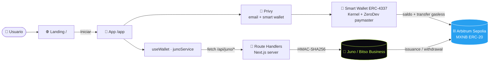
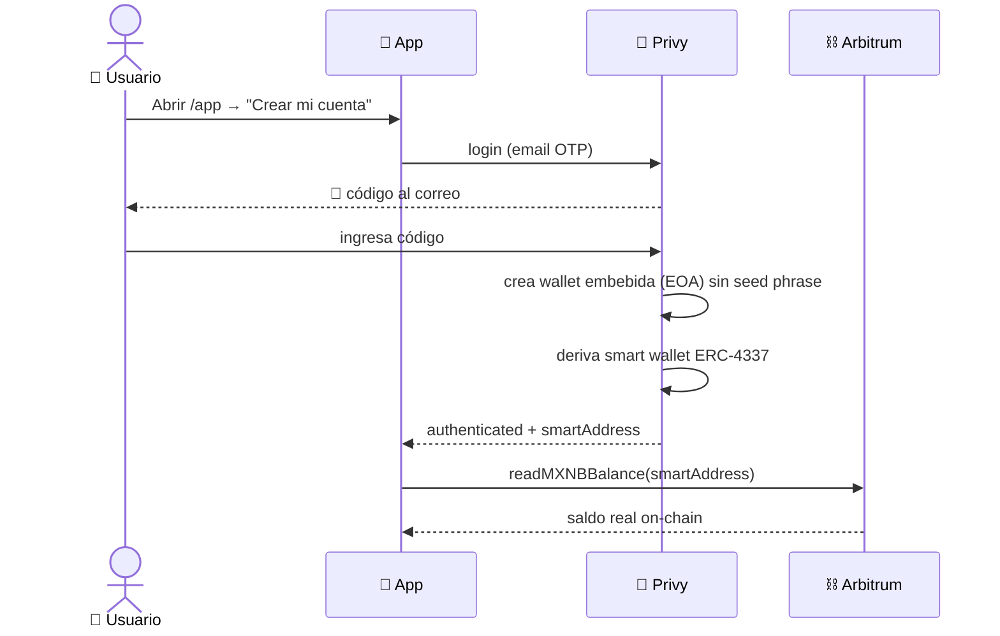
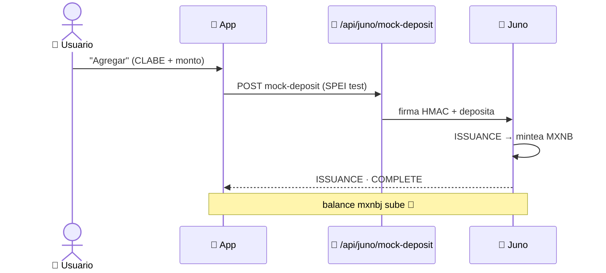
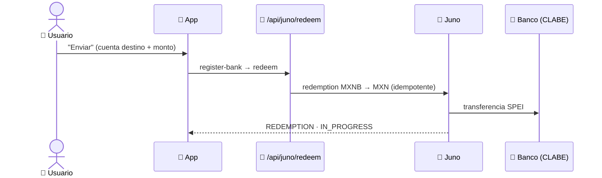
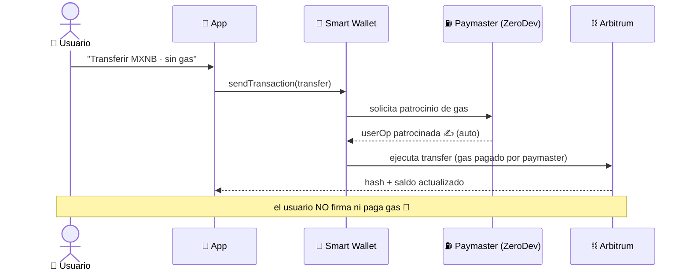
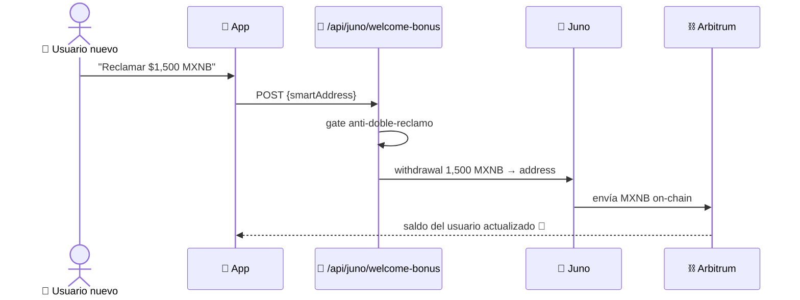

<div align="center">

# 🦊 Seyf

### La super app de finanzas para ahorrar, invertir y gastar sin fronteras

**Pesos digitales que rinden · Bonos de gobierno de 4 países · Bóvedas de ahorro · Tarjeta multi-divisa**
**Powered by MXNB (Bitso Business / Juno) + wallets sociales sin seed phrase + gas patrocinado**

<br/>


<br/>

`/` → 🌐 Landing &nbsp;·&nbsp; `/app` → 📱 Wallet &nbsp;·&nbsp; `/api/juno/*` → 🔌 12 endpoints

</div>

---

## 📑 Índice

- [✨ Qué es Seyf](#-qué-es-seyf)
- [🧩 Características](#-características)
- [🏗️ Arquitectura](#️-arquitectura)
- [🔄 Flujos](#-flujos)
- [✅ Probado end-to-end](#-probado-end-to-end)
- [🛠️ Stack](#️-stack)
- [🔌 API (endpoints)](#-api-endpoints)
- [🗺️ Rutas](#️-rutas)
- [⚡ Arranque rápido](#-arranque-rápido)
- [🔐 Variables de entorno](#-variables-de-entorno)
- [📁 Estructura](#-estructura)
- [🛡️ Seguridad](#️-seguridad)
- [🧭 Roadmap](#-roadmap)

---

## ✨ Qué es Seyf

Seyf es una **wallet de finanzas personales** que combina tres mundos en una sola app:

| | |
|---|---|
| 💸 **Fiat ↔ Cripto sin fricción** | Depósitos y retiros por **SPEI** se convierten a **MXNB** (stablecoin MXN) vía **Bitso Business / Juno**. |
| 🔑 **Onboarding sin seed phrase** | El usuario entra con **correo** y obtiene una **smart wallet** en Arbitrum — sin extensiones, sin frases semilla. |
| ⛽ **Sin gas, sin firmas** | Las transacciones on-chain del usuario son **patrocinadas** (account abstraction ERC-4337 + paymaster). |

> Diseño dark glassmorphism con acento **lima `#C8FF4D`** + **violeta `#8B5CF6`**, responsive (móvil y escritorio).

---

## 🧩 Características

| Módulo | Descripción | Estado |
|--------|-------------|:------:|
| 🌐 **Landing** | Hero animado, contadores, marquee, bento, FAQ, tilt 3D — CTA **Iniciar → /app** | ✅ |
| 📱 **App wallet** | Inicio, Pesos digitales, Bonos, Bóvedas, Tarjeta, Perfil | ✅ |
| 🔑 **Login social (Privy)** | Email OTP, wallet embebida **sin seed phrase** | ✅ |
| 🧠 **Account abstraction** | Smart wallet ERC-4337 (Kernel) + paymaster (ZeroDev) | ✅ |
| ⛽ **Gas patrocinado** | Transferir MXNB **sin firmar ni pagar gas** | ✅ |
| 💰 **Saldo on-chain real** | Lectura de MXNB (ERC-20) de la wallet del usuario (viem) | ✅ |
| 🏦 **Issuance (depósito)** | SPEI → minteo de MXNB (Juno) | ✅ |
| 💱 **Redemption (retiro)** | MXNB → MXN por SPEI a una CLABE | ✅ |
| 🎁 **Bono de bienvenida** | 1,500 MXNB on-chain a usuarios nuevos (testnet) | ✅ |

---

## 🏗️ Arquitectura



**Principio clave:** los **secretos de Juno viven solo en el servidor** (route handlers firman HMAC). El frontend nunca firma ni ve credenciales. El saldo **por usuario** se lee on-chain de su smart wallet (no del balance de negocio de Juno).

---

## 🔄 Flujos

### 1) Onboarding + smart wallet (sin seed phrase)



### 2) Depósito · Issuance (SPEI → MXNB)



### 3) Retiro · Redemption (MXNB → MXN)



### 4) Transferencia on-chain · gasless (account abstraction)



### 5) Bono de bienvenida (1,500 MXNB)



---

## ✅ Probado end-to-end

Validado contra **Juno stage** (`stage.buildwithjuno.com`) — issuance y redemption reales:

```jsonc
// 1) ISSUANCE — POST /api/juno/mock-deposit  ($2,000)
{ "transaction_type": "ISSUANCE", "amount": 2000, "summary_status": "COMPLETE", "network": "ARBITRUM" }

// 2) BALANCE tras issuance
{ "asset": "mxnbj", "total": 2000, "available": 2000 }   // 💚 minteado

// 3) REGISTER-BANK
{ "id": "3185a6c9-…", "clabe": "646180…", "ownership": "THIRD_PARTY" }

// 4) REDEEM — POST /api/juno/redeem  (100 MXNB → MXN)
{ "transaction_type": "REDEMPTION", "amount": 100, "method": "SPEI", "summary_status": "IN_PROGRESS" }
```

> Reproduce el test: arranca `npm run dev` y corre los `curl` de [Arranque rápido](#-arranque-rápido).

---

## 🛠️ Stack

| Capa | Tecnología |
|------|------------|
| **Framework** | Next.js 16 (App Router, Turbopack) · React 19 · TypeScript 5 |
| **Estilos** | Tailwind v4 + CSS tokens (dark glassmorphism) |
| **Auth + Wallets** | Privy (`@privy-io/react-auth`) — email OTP + smart wallets |
| **Account abstraction** | ERC-4337 · Kernel · paymaster ZeroDev · bundler Pimlico · `permissionless` |
| **On-chain** | `viem` — lectura ERC-20 y transfer en Arbitrum Sepolia |
| **Rieles fiat** | Bitso Business / Juno (MXNB) — HMAC-SHA256, `crypto` + `fetch` nativos |

---

## 🔌 API (endpoints)

Todos bajo `/api/juno/*` (route handlers server-side, firma HMAC).

| Método | Ruta | Función |
|:------:|------|---------|
| `GET`  | `/api/juno/health` | Estado + si hay credenciales |
| `GET`  | `/api/juno/account-details` | CLABEs de depósito (issuance) |
| `POST` | `/api/juno/create-clabe` | Crear CLABE única |
| `POST` | `/api/juno/mock-deposit` | **Issuance** (SPEI test → MXNB) |
| `GET`  | `/api/juno/balance` | Balances (MXNB) |
| `GET`  | `/api/juno/transactions` | Historial |
| `GET`  | `/api/juno/bank-accounts` | Cuentas registradas |
| `POST` | `/api/juno/register-bank` | Registrar CLABE destino |
| `POST` | `/api/juno/redeem` | **Redemption** (MXNB → MXN) |
| `POST` | `/api/juno/withdrawal` | Retiro on-chain de MXNB |
| `POST` | `/api/juno/welcome-bonus` | Bono de bienvenida (1,500 MXNB) |
| `POST` | `/api/juno/webhook` | Eventos async (firma verificada) |

---

## 🗺️ Rutas

| Ruta | Pantalla |
|------|----------|
| `/` | 🌐 **Landing** — primera pantalla, CTA **Iniciar / Iniciar ahora → /app** |
| `/app` | 📱 **App** — onboarding (login) → Inicio · Wallet · Bonos · Bóvedas · Tarjeta · Perfil |

---

## ⚡ Arranque rápido

```bash
# 1) Configura credenciales
cp .env.example .env.local
#   → BITSO_APIKEY / BITSO_SECRET_APIKEY (Juno stage)
#   → NEXT_PUBLIC_PRIVY_APP_ID (dashboard.privy.io)

# 2) Instala y corre
npm install
npm run dev          # http://localhost:3000
```

**Probar los rieles fiat (issuance + redeem):**

```bash
# CLABE de negocio
curl -s localhost:3000/api/juno/account-details

# ISSUANCE: mintea MXNB a la CLABE del negocio
curl -s -X POST localhost:3000/api/juno/mock-deposit \
  -H 'content-type: application/json' \
  -d '{"amount":"2000","receiver_clabe":"<CLABE>","receiver_name":"Seyf","sender_name":"Test"}'

# Confirma el saldo
curl -s localhost:3000/api/juno/balance

# REDEEM: MXNB → MXN (necesita un bank_account_id de register-bank)
curl -s -X POST localhost:3000/api/juno/redeem \
  -H 'content-type: application/json' \
  -d '{"amount":100,"destination_bank_account_id":"<ID>"}'
```

**Probar wallet + gasless:** entra a `/app` con tu correo → reclama el **bono de $1,500** → ve a **Wallet → Transferir MXNB on-chain · sin gas**.

---

## 🔐 Variables de entorno

| Variable | Lado | Req. | Descripción |
|----------|:----:|:----:|-------------|
| `BITSO_APIKEY` | server | ✅ | API key de Juno (stage) |
| `BITSO_SECRET_APIKEY` | server | ✅ | API secret de Juno (stage) |
| `JUNO_BASE_URL` | server | ⬜ | Default `https://stage.buildwithjuno.com` |
| `JUNO_WEBHOOK_SECRET` | server | ⬜ | Verificación de webhooks |
| `WELCOME_BONUS_AMOUNT` | server | ⬜ | Monto del bono (default `1500`) |
| `NEXT_PUBLIC_PRIVY_APP_ID` | cliente | ✅* | App ID de Privy (sin él → modo demo) |
| `NEXT_PUBLIC_CHAIN` | cliente | ⬜ | `arbitrum-sepolia` (default) o `arbitrum` |
| `NEXT_PUBLIC_MXNB_ADDRESS` | cliente | ⬜ | Contrato MXNB (autodetecta por red) |
| `NEXT_PUBLIC_ARBITRUM_RPC` | cliente | ⬜ | RPC custom de Arbitrum |

> ⚠️ Las llaves de Juno **nunca** van con prefijo `NEXT_PUBLIC_`. El gas patrocinado (smart wallet + paymaster) se configura en el **dashboard de Privy**.

**Contratos MXNB (oficiales):** Sepolia `0x82B9e52b26A2954E113F94Ff26647754d5a4247D` · Mainnet `0xF197FFC28c23E0309B5559e7a166f2c6164C80aA` (6 decimales).

---

## 📁 Estructura

```
src/
├── app/
│   ├── page.tsx              # 🌐 Landing (/)
│   ├── landing.css           # estilos landing (scoped .lp)
│   ├── app/
│   │   ├── layout.tsx        # Providers (Privy) solo en /app
│   │   └── page.tsx          # 📱 App (/app)
│   ├── layout.tsx · globals.css
│   └── api/juno/*/route.ts   # 🔌 12 endpoints (HMAC)
├── components/
│   ├── landing/Landing.tsx   # landing portada
│   ├── Providers.tsx         # PrivyProvider + SmartWalletsProvider
│   ├── wallet/               # WalletContext + PrivyBridge (auth + saldo + gasless)
│   └── app/
│       ├── SeyfApp.tsx       # shell + router + tabbar
│       ├── screens/          # core · invest · account
│       ├── modals/           # Deposit · Redeem · SendOnchain
│       └── WelcomeBonus.tsx  # 🎁 bono
├── hooks/useJuno.ts          # hooks de React (balance, txns, acciones)
├── services/junoService.ts   # cliente tipado
├── lib/
│   ├── juno/                 # firma HMAC + cliente server-side
│   └── chain.ts              # viem · MXNB · readBalance
└── types/juno.ts
_prototype/                   # prototipo original (referencia de diseño)
```

---

## 🛡️ Seguridad

- 🔒 **Secretos solo en servidor** — issuance/redeem firman HMAC en route handlers; el cliente nunca ve llaves.
- 🚫 **Sin seed phrase** — wallets embebidas/inteligentes de Privy; el usuario entra con correo.
- 🧾 **Idempotencia** — `X-Idempotency-Key` en redeem y withdrawal.
- ✅ **Webhook firmado** — verificación `timingSafeEqual`.
- 🧪 **`mock-deposit`** restringido a `/spei/test/*` de stage.

---

## 🧭 Roadmap

- [ ] Verificación de usuario en el backend (Privy `server-auth` + App Secret) para atar issuance/redeem al usuario logueado.
- [ ] Persistir el gate del bono en base de datos (hoy es best-effort en memoria).
- [ ] Bonos/Bóvedas con flujos on-chain reales.
- [ ] Webhooks de Juno → actualización de saldos en tiempo real.

---

## 📚 Documentación

- 📘 [`INTEGRATION.md`](./INTEGRATION.md) — integración Juno/Bitso + Privy (endpoints, env, flujos, **changelog**).
- 📐 [`PLAN-NextJS-ClaudeCode.md`](./PLAN-NextJS-ClaudeCode.md) — plan de la landing.

<div align="center">
<br/>
Hecho con 💚 para <b>EthMex 2026</b> · MXNB · Arbitrum · Privy
</div>
