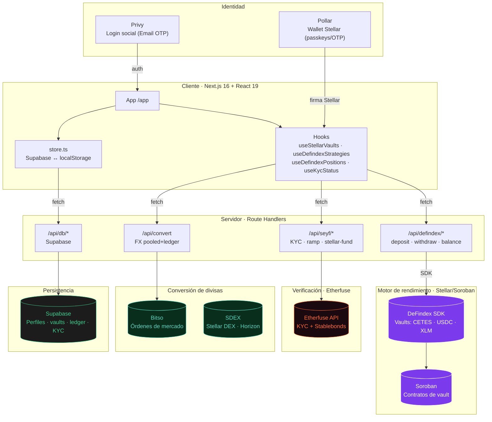
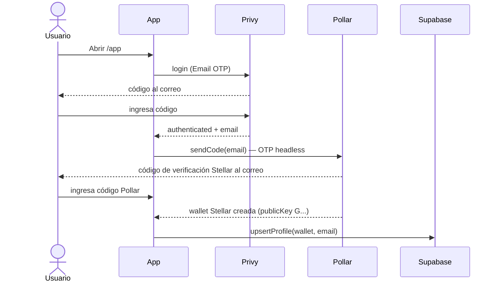
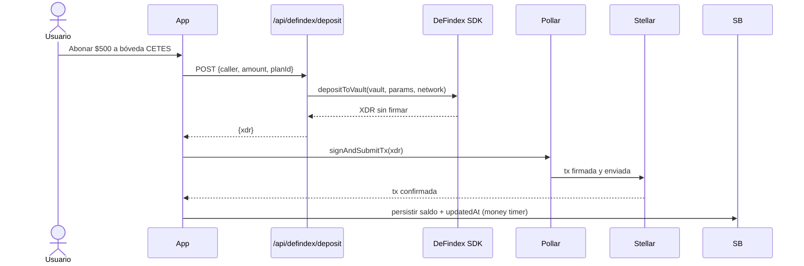
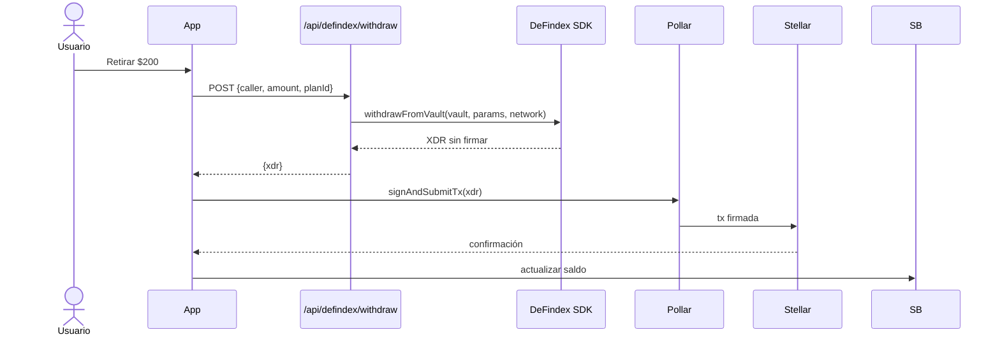
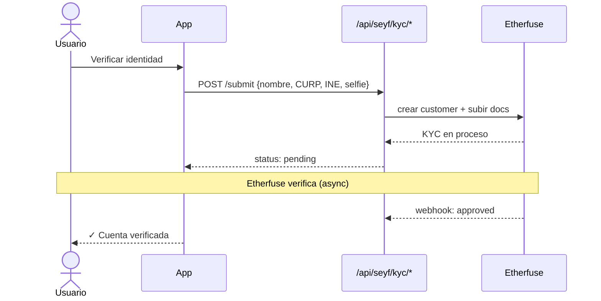

<div align="center">

# SEYF

### La super app de ahorro e inversión sobre Stellar

Bóvedas de rendimiento real (CETES, USDC, XLM) · KYC integrado · On-ramp SPEI · Wallet embebida sin seed phrase
Construida sobre **Stellar/Soroban**, **DeFindex**, **Etherfuse** y **Pollar**.

<br/>


</div>

---

## Tabla de contenidos

- [Qué es SEYF](#qué-es-seyf)
- [Arquitectura](#arquitectura)
- [Tecnologías](#tecnologías)
- [Flujos principales](#flujos-principales)
- [Estrategias DeFindex](#estrategias-defindex)
- [API (endpoints)](#api-endpoints)
- [Variables de entorno](#variables-de-entorno)
- [Arranque](#arranque)
- [Estructura del proyecto](#estructura-del-proyecto)
- [Seguridad](#seguridad)
- [Roadmap](#roadmap)

---

## Qué es SEYF

SEYF es una plataforma de ahorro e inversión para México que combina la experiencia de un neobank (SPEI, pesos, copy simple) con infraestructura DeFi sobre Stellar que el usuario nunca ve:

| | |
|---|---|
| **Bóvedas de rendimiento real** | Depósitos en vaults DeFindex (Soroban) con estrategias CETES (~10.5% APY), USDC (~4.5%) y XLM (~2.8%). El saldo y rendimiento son on-chain. |
| **Wallet sin seed phrase** | El usuario entra con correo (Privy) y firma en Stellar con **Pollar** (passkeys/OTP). Sin extensiones ni frases semilla. |
| **KYC integrado** | Verificación de identidad (CURP, INE, selfie) dentro de la app vía **Etherfuse**. El usuario nunca sale de SEYF. |
| **On-ramp SPEI** | Depósitos en pesos por transferencia bancaria. CLABE individual por usuario. |
| **Conversión de divisas** | XLM ↔ USDC vía SDEX (Stellar DEX). MXN ↔ fiat vía Bitso. |

Cada usuario tiene **saldo real on-chain en Stellar**, bóvedas con rendimiento verificable, KYC persistido y un perfil multi-dispositivo en Supabase.

---

## Arquitectura



**Principios de diseño:**

- **Secrets en el servidor** — API keys de DeFindex, Etherfuse, Bitso nunca llegan al navegador.
- **Saldo real on-chain** — El balance del usuario se lee de la vault DeFindex en Stellar, no de una base de datos.
- **Firma del usuario** — Cada depósito/retiro requiere que el usuario autorice con OTP o passkey (Pollar).
- **Money timer** — El saldo crece en pantalla en tiempo real, anclado al `updated_at` de Supabase y el APY de la estrategia.

---

## Tecnologías

| Capa | Tecnología | Rol |
|------|-----------|-----|
| **Framework** | Next.js 16 (App Router, Turbopack) · React 19 · TypeScript 5 | UI + API routes |
| **Blockchain** | Stellar (Soroban) · Testnet/Mainnet | Red donde viven los fondos |
| **Yield vaults** | [DeFindex](https://defindex.io) (`@defindex/sdk`) | Vaults de rendimiento (CETES, USDC, XLM) |
| **DEX** | Stellar SDEX (Horizon path payments) | XLM ↔ USDC on-chain |
| **Wallet Stellar** | [Pollar](https://pollar.xyz) (`@pollar/core`, `@pollar/react`) | Wallet embebida con passkeys/OTP headless |
| **Auth** | [Privy](https://privy.io) (`@privy-io/react-auth`) | Login social (Email OTP) |
| **KYC + Bonos** | [Etherfuse](https://etherfuse.com) | Verificación de identidad + CETES tokenizados |
| **On-ramp fiat** | SPEI (Juno / Dynerox) | Depósitos y retiros en pesos mexicanos |
| **FX** | Bitso REST API | Conversiones MXN ↔ divisas (pooled+ledger) |
| **Persistencia** | [Supabase](https://supabase.com) (Postgres) | Perfiles, vaults, ledger, KYC, rate limits |

---

## Flujos principales

### Onboarding + wallet Stellar



### Depósito en bóveda DeFindex



### Retiro de bóveda



### KYC (Etherfuse)



---

## Estrategias DeFindex

| Estrategia | Plan | Vault (testnet) | Asset | APY ref. | Riesgo |
|------------|------|-----------------|-------|----------|--------|
| **CETES** | Conservador | `CBIS5TEM...NLF2P` | CETES (7 dec) | ~10.5% | Bajo |
| **USDC** | Moderado | `CBMVK2JK...DWHN` | USDC (7 dec) | ~4.5% | Bajo |
| **XLM** | Balanceado | `CCLV4H7W...GFSF6` | XLM (7 dec) | ~2.8% | Medio |

Contratos de estrategia (Blend):
- CETES: `CCP4RBDWPRNO2LWO23XFU4BBLGA73J5N3BK7EHRJUHVN33YEMMFB2MBE`
- USDC: `CALLOM5I7XLQPPOPQMYAHUWW4N7O3JKT42KQ4ASEEVBXDJQNJOALFSUY`
- XLM: `CDVLOSPJPQOTB6ZCWO5VSGTOLGMKTXSFWYTUP572GTPNOWX4F76X3HPM`

Factory DeFindex: `CDSCWE4GLNBYYTES2OCYDFQA2LLY4RBIAX6ZI32VSUXD7GO6HRPO4A32`

---

## API (endpoints)

### `/api/defindex/*` — Bóvedas de rendimiento (DeFindex SDK, server-side)

| Método | Ruta | Función |
|:------:|------|---------|
| `POST` | `/api/defindex/deposit` | Construye XDR de depósito |
| `POST` | `/api/defindex/withdraw` | Construye XDR de retiro |
| `GET` | `/api/defindex/balance` | Saldo del usuario en vault |
| `GET` | `/api/defindex/vault-info` | Info de la vault (APY, TVL) |
| `GET` | `/api/defindex/strategies` | Estrategias disponibles con APY en vivo |
| `GET` | `/api/defindex/positions` | Posiciones on-chain del usuario |
| `POST` | `/api/defindex/prepare` | Re-simula y prepara XDR Soroban |

### `/api/seyf/*` — KYC, ramp y Stellar (Etherfuse + Pollar)

| Método | Ruta | Función |
|:------:|------|---------|
| `POST` | `/api/seyf/kyc/submit` | Enviar datos de identidad |
| `POST` | `/api/seyf/kyc/documents` | Subir INE + selfie |
| `POST` | `/api/seyf/kyc/agreements` | Aceptar términos |
| `GET` | `/api/seyf/kyc/status` | Estado de verificación |
| `POST` | `/api/seyf/stellar-fund` | Fondear wallet testnet (Friendbot) |
| `GET` | `/api/seyf/etherfuse/readiness` | Preparación para on-ramp |
| `POST` | `/api/seyf/etherfuse/order/onramp` | Crear orden de compra |
| `GET` | `/api/seyf/etherfuse/quote/onramp` | Cotización SPEI→asset |

### `/api/db/*` — Persistencia (Supabase)

| Método | Ruta | Función |
|:------:|------|---------|
| `GET/POST` | `/api/db/profile` | Perfil del usuario |
| `GET/POST/DELETE` | `/api/db/vaults` | Bóvedas de ahorro |
| `GET/POST` | `/api/db/conversions` | Conversiones FX |
| `GET/POST` | `/api/db/limits` | Límites mensuales |

### `/api/sdex/*` — Conversión XLM↔USDC (Stellar DEX / Horizon)

| Método | Ruta | Función |
|:------:|------|---------|
| `POST` | `/api/sdex/quote` | Cotiza path payment en SDEX |
| `POST` | `/api/sdex/build` | Construye XDR sin firmar |
| `POST` | `/api/sdex/send` | Envía XDR firmado a Horizon |

### `/api/convert` — Conversión FX (Bitso, pooled+ledger)

| Método | Ruta | Función |
|:------:|------|---------|
| `POST` | `/api/convert` | Orden de mercado MXN ↔ divisa |

---

## Variables de entorno

| Variable | Lado | Descripción |
|----------|:----:|-------------|
| `NEXT_PUBLIC_STELLAR_VAULTS` | cliente | `true` para activar el riel Stellar/DeFindex |
| `DEFINDEX_API_KEY` | server | API key del SDK DeFindex (`sk_...`) |
| `DEFINDEX_BASE_URL` | server | Default `https://api.defindex.io` |
| `NEXT_PUBLIC_DEFINDEX_VAULT_ADDRESS` | cliente | Vault principal (CETES) |
| `NEXT_PUBLIC_POLLAR_API_KEY` | cliente | Publishable key de Pollar |
| `NEXT_PUBLIC_POLLAR_STELLAR_NETWORK` | cliente | `testnet` o `pubnet` |
| `ETHERFUSE_API_KEY` | server | API key de Etherfuse |
| `ETHERFUSE_API_BASE_URL` | server | URL base Etherfuse |
| `NEXT_PUBLIC_PRIVY_APP_ID` | cliente | App ID de Privy (login) |
| `SUPABASE_URL` | server | URL del proyecto Supabase |
| `SUPABASE_SERVICE_ROLE_KEY` | server | Service role key |
| `NEXT_PUBLIC_USE_SUPABASE` | cliente | `true` para persistencia real |
| `BITSO_APIKEY` | server | API key de Bitso (FX) |
| `BITSO_SECRET_APIKEY` | server | Secret de Bitso |

---

## Arranque

```bash
cp .env.example .env.local    # Completar las keys
npm install
npm run dev                   # http://localhost:3000
```

**Requisitos para testnet:**
1. API key de DeFindex (crear en `api.defindex.io`)
2. API key de Pollar (crear en `dashboard.pollar.xyz`, modo testnet)
3. Wallet fondeada con el asset de la vault (USDC/CETES en Stellar testnet)
4. App de Privy configurada con Email como método de login

---

## Estructura del proyecto

```
src/
  app/
    api/
      defindex/          # 7 endpoints (DeFindex SDK)
      seyf/              # KYC + ramp + stellar-fund
      db/                # Persistencia Supabase
      convert/           # FX via Bitso
      juno/              # On-ramp SPEI (legacy)
  components/
    app/
      SeyfApp.tsx        # Shell + router + tabbar
      VaultCarousel.tsx  # Carrusel de bóvedas
      StellarConnectGate.tsx  # Gate OTP para firmar
      screens/           # core · invest · kyc · account
      modals/            # Deposit · Redeem · Send
    landing/             # Landing portada
    providers/
      SeyfPollarProvider.tsx  # Pollar SDK wrapper
  hooks/
    useStellarVaults.ts       # Bóvedas Stellar (principal)
    useDefindexStrategies.ts  # APY en vivo
    useDefindexPositions.ts   # Posiciones on-chain
    useKycStatus.ts           # Estado KYC
  lib/
    defindex/            # SDK client, catalog, vaults config
    seyf/                # Guards, KYC, ramp, wallet Pollar
    pollar/              # Session, client-api, sign
    etherfuse/           # KYC, orders, webhook
    bitso/               # FX orders
    supabase/            # DB helpers
    store.ts             # Capa storage (Supabase ↔ localStorage)
```

---

## Seguridad

- **API keys en servidor** — DeFindex, Etherfuse, Bitso, Supabase service_role nunca expuestas al cliente.
- **Firma del usuario** — Cada transacción Stellar requiere OTP o passkey vía Pollar.
- **Idempotencia** — Conversiones FX y órdenes de ramp con key única.
- **Webhook verificado** — Etherfuse webhooks con validación de firma.
- **Rate limiting** — Protección contra abuso en endpoints sensibles (Supabase-backed).
- **Sin seed phrase** — Las llaves las gestiona Pollar (passkeys del dispositivo).

---

## Roadmap

| Prioridad | Feature | Detalle |
|:---------:|---------|---------|
| 🔴 | **Mainnet** | Migrar vaults DeFindex a pubnet, Pollar mainnet, Etherfuse producción |
| 🟢 | **SDEX** | XLM↔USDC vía Stellar DEX (path payments) — activo |
| 🟡 | **Revenue** | Spread en FX + performance fee en vaults (fee_receiver DeFindex) |
| 🟡 | **On-ramp directo** | SPEI → vault en un paso (Dynerox → Stellar → DeFindex deposit) |
| 🟡 | **Blend lending** | Adelanto de liquidez 0% sobre la posición en vault (Blend protocol) |
| 🟢 | **Auditoría** | Smart contract audit antes de mainnet con fondos reales |
| 🟢 | **Multi-país** | Expansión a Colombia / Argentina |

---

<div align="center">
<br/>

Construido sobre **Stellar** · DeFindex · SDEX · Etherfuse · Pollar · Supabase

</div>
