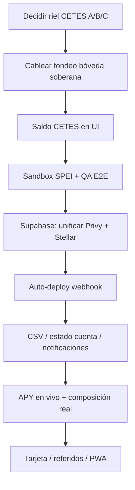

# SEYF — Pendientes y oportunidades de producto

**Versión:** 1.0  
**Fecha:** Junio 2026  
**App:** SEYF (`Seyf2/`)  
**Estado:** Inventario vivo — complementa el [PRD](./seyf-app-prd.md) y la doc de [Etherfuse KYC](./etherfuse-kyc-stablebonds.md).

---

## Tabla de contenidos

1. [Resumen ejecutivo](#1-resumen-ejecutivo)
2. [Lo que ya está listo](#2-lo-que-ya-está-listo)
3. [Bloqueadores de producto](#3-bloqueadores-de-producto-decidir-primero)
4. [Pendientes técnicos](#4-pendientes-técnicos)
5. [Quick wins](#5-quick-wins-alto-impacto-bajo-esfuerzo-relativo)
6. [Pendientes del PRD (Fases 3–5)](#6-pendientes-del-prd-fases-35)
7. [UI ya diseñada pero sin backend](#7-ui-ya-diseñada-pero-sin-backend)
8. [Ideas nuevas alineadas con SEYF](#8-ideas-nuevas-alineadas-con-seyf)
9. [Roadmap sugerido](#9-roadmap-sugerido)
10. [Referencias](#10-referencias)

---

## 1. Resumen ejecutivo

El **core de ahorro en Arbitrum** (Privy, MXNB, SPEI, bóvedas, conversión FX, adelanto de liquidez, proyecciones) está en buen estado. La integración **Etherfuse + Pollar (KYC + CETES)** está portada a nivel backend y el flujo KYC ya vive dentro del shell de la app.

Lo que más falta para un producto demo-convincente:

1. **Decidir y cablear el riel de fondeo** de la bóveda soberana (CETES).
2. **Mostrar saldo real** de bonos tokenizados en la UI.
3. **Completar el ciclo post-depósito** (webhook → auto-deploy → reflejo en bóveda).
4. **Unificar identidades** Privy (Arbitrum) ↔ Stellar (Etherfuse) en Supabase.

---

## 2. Lo que ya está listo

| Módulo | Descripción | Estado |
|--------|-------------|:------:|
| Landing | Hero, FAQ, CTA → `/app` | ✅ |
| Login (Privy) | Email OTP, wallet embebida sin seed phrase | ✅ |
| Account abstraction | Smart wallet ERC-4337 + paymaster + bundler | ✅ |
| Saldo on-chain | Lectura MXNB real (viem), refresco periódico | ✅ |
| Depósito | SPEI/CLABE + fondeo MXNB; UI optimista | ✅ |
| Enviar | Transferencia MXNB gasless | ✅ |
| Redeem | MXNB → MXN por SPEI a CLABE registrada | ✅ |
| Historial | Txns on-chain + pendientes optimistas | ✅ |
| Bóvedas | Crear, abonar, retirar + Supabase | ✅ |
| Convertir | MXNB ↔ divisas (Bitso) + historial | ✅ |
| Perfil de riesgo | Quiz 5 preguntas → 4 estrategias | ✅ |
| Proyecciones | 10/20/30 años + comparativa vs Afore | ✅ |
| Adelanto de liquidez | Colateral + modal + hooks | ✅ |
| Bono de bienvenida | 1,500 MXNB testnet | ✅ |
| Perfil persistido | Supabase (wallet, email, risk_profile) | ✅ |
| Límites mensuales | Depósito/retiro por período | ✅ |
| KYC Etherfuse | Flujo interno (`ScreenKyc`) + APIs | ✅ |
| Banners KYC | Inicio y Perfil conectados a `useKycStatus` | ✅ |
| Bóveda soberana (designación) | Plan conservador gateado por KYC | ✅ |
| Build | `npm run build` pasa | ✅ |

### Parcialmente listo / mock

| Módulo | Notas |
|--------|-------|
| Tarjeta (`ScreenCard`) | UI con datos mock (`CARD_TXNS`) |
| Notificaciones (`ScreenNotifs`) | Pantalla existe; sin eventos reales |
| Recompensas | Ruta apunta a perfil; sin lógica propia |
| Menú “Más” | Reportes, estado de cuenta, promos → “Próximamente” |
| Tema de color | 5 acentos en localStorage (funcional) |
| APY de bóvedas | Valores estáticos en `data.ts`, no en vivo |
| Bóveda soberana (fondeo) | Designada + KYC; **onramp no cableado** |

---

## 3. Bloqueadores de producto (decidir primero)

### 3.1 Riel de fondeo de la bóveda soberana (CETES)

El onramp de Etherfuse es **fiat MXN (SPEI/CLABE) → CETES en Stellar**. Las bóvedas actuales se fondean con **MXNB on-chain (Arbitrum)**. Hasta resolver esto, la bóveda conservadora queda gateada por KYC pero **no compra bonos al abonar**.

| Opción | Descripción | Pros | Contras |
|--------|-------------|------|---------|
| **(A) SPEI directo a Etherfuse** | El depósito de esa bóveda va por SPEI a la CLABE de Etherfuse (no a Juno) | Reusa onramp tal cual; menos piezas | Saldo no pasa por MXNB; dos rieles visibles internamente |
| **(B) Off-ramp + on-ramp** | MXNB → fiat → SPEI a Etherfuse | Unifica narrativa “todo desde MXNB” | Dos rampas, más fricción y costo |
| **(C) Swap on-chain stable→bono** | Compra con stablecoin como origen | Un solo riel on-chain | Etherfuse **no lo expone hoy**; confirmar con el proveedor |

**Doc relacionada:** [etherfuse-pollar-boveda.md](./etherfuse-pollar-boveda.md) §8, [etherfuse-kyc-stablebonds.md](./etherfuse-kyc-stablebonds.md) §Decisión pendiente.

---

### 3.2 Unificación Privy ↔ Stellar en Supabase

Hoy coexisten:

- **Privy + Arbitrum:** MXNB, bóvedas, SPEI Juno/Bitso.
- **Pollar + Stellar:** KYC Etherfuse, CETES.

La sesión Etherfuse vive en cookie `seyf_ef_onboarding` (+ Redis opcional). El perfil Supabase **no persiste** aún:

- `stellar_public_key`
- `etherfuse_customer_id`

**Impacto si no se hace:** multi-dispositivo frágil, soporte difícil, riesgo de sesiones stale.

---

### 3.3 Auto-deploy post-depósito

| Componente | Estado |
|------------|--------|
| Webhook Etherfuse | ✅ Implementado |
| Auto-deploy inversión | ⏸ Stub en `spei-deposit-auto-deploy.ts` (solo log) |
| Notificaciones post-onramp | ❌ No portadas desde seyf-app |

**Flujo objetivo:** SPEI recibido → orden onramp confirmada → CETES acreditados en Stellar → saldo reflejado en bóveda soberana en la UI.

---

## 4. Pendientes técnicos

### 4.1 Etherfuse / Stablebonds

| Ítem | Detalle | Prioridad |
|------|---------|-----------|
| Orquestación swap MXN→bono al fondear bóveda | Bloqueada por decisión de riel (§3.1) | 🔴 Alta |
| Sandbox SPEI | Portar `POST /api/seyf/etherfuse/sandbox/fiat-received` | 🔴 Alta |
| Dashboard CETES en UI | `dashboard-cetes-saldo`, `cetes-mxne-equiv` en `lib/seyf` sin conectar a Home/bóvedas | 🟡 Media |
| Readiness CTA en bóveda soberana | `etherfuse-readiness-cta.ts` existe; falta cablear en pantalla de bóveda | 🟡 Media |
| Trustline CETES | Hook `useEnsureCetesTrustline` existe; validar en flujo completo | 🟡 Media |
| UI KYC avanzada | Traer `identidad-client.tsx` de seyf-app o pulir validaciones del MVP | 🟢 Baja |
| Modo KYC hosted | Lógica en `onboarding.ts`; UI redirect no expuesta | 🟢 Baja |
| Rutas `/app/etherfuse/*` | Eliminadas; KYC es interno — confirmar que no falte nada | ✅ Hecho |

### 4.2 Backend / infra

| Ítem | Detalle | Prioridad |
|------|---------|-----------|
| Auth server-side en `/api/seyf/*` | Scoped por cookie/body; sin JWT Privy | 🟡 Media |
| Tests Vitest `lib/etherfuse` | Archivos copiados; no cableados en `package.json` / CI | 🟡 Media |
| Redis (Upstash) | Sin él: estado en cookie; rate limits KYC más permisivos | 🟡 Media |
| Cron APY | Blend, Aquarius, Etherfuse rates — hoy estáticos | 🟢 Baja |
| i18n centralizado | seyf-app usaba `messages/es-MX.json`; SEYF textos inline | 🟢 Baja |

### 4.3 Supabase / persistencia

| Ítem | Detalle | Prioridad |
|------|---------|-----------|
| Perfil unificado Privy + Stellar | Ver §3.2 | 🔴 Alta |
| Migración FX pendiente | Ver [sesion-2026-06-04-fx-conversion.md](./sesion-2026-06-04-fx-conversion.md) | 🟡 Media |

### 4.4 QA y lanzamiento (PRD Fase 5)

| Ítem | Estado |
|------|--------|
| QA end-to-end flujos principales | Pendiente |
| PostHog (analytics) | Pendiente |
| Sentry (monitoreo) | Pendiente |
| Pentest backend/APIs | Pendiente |
| Auditoría smart contracts | Pendiente |
| Beta cerrada 50 usuarios | Pendiente |
| Runbooks operativos | Pendiente |

---

## 5. Quick wins (alto impacto, bajo esfuerzo relativo)

Cosas donde **ya hay backend o lógica** y solo falta UI o conexión.

| # | Feature | Qué falta | Impacto |
|---|---------|-----------|---------|
| 1 | **Saldo CETES en Home / bóveda soberana** | Conectar hooks/APIs existentes en `lib/seyf` | Usuario ve valor real del producto soberano |
| 2 | **Estados KYC intermedios en Perfil** | Mostrar “En revisión”, “Rechazado”, etc. (no solo verificado / no verificado) | Menos confusión post-submit |
| 3 | **Checklist de onboarding en Home** | Cuenta → CLABE → 1er depósito → bóveda → KYC | Mejora conversión demo/beta |
| 4 | **Sandbox SPEI** | Una ruta dev para simular depósito sin banco | Desbloquea QA del flujo CETES |
| 5 | **Export CSV movimientos** | UI en `MoreSheet`; datos en Supabase + on-chain | Feature del PRD (US-09) |
| 6 | **Estado de cuenta mensual** | UI en `MoreSheet`; calcular de txns reales | Confianza bancaria |
| 7 | **Notificaciones reales** | Conectar `ScreenNotifs` a eventos (depósito, KYC, rendimiento) | Cierra loops de producto |
| 8 | **Email/push al aprobar KYC** | Trigger desde webhook o polling | Usuario no tiene que revisar manualmente |
| 9 | **Tests Etherfuse en CI** | `npm test` + pipeline | Regresiones en integración crítica |
| 10 | **Refresh KYC al volver a la app** | `useKycStatus` ya escucha `focus` y evento custom | ✅ Hecho recientemente |

---

## 6. Pendientes del PRD (Fases 3–5)

Referencia: [seyf-app-prd.md](./seyf-app-prd.md) §8 Implementation Roadmap.

### Fase 3 — Dashboard y proyecciones

| Tarea | Story | Estado |
|-------|-------|--------|
| Gráfico de proyección interactivo (10/20/30 años) | US-06 | Parcial (`ProjectionCard` colapsable) |
| Cálculo de proyección con parámetros del usuario | US-06 | Parcial |
| Módulo composición y rendimiento del portfolio | US-07 | Parcial (donut en bóvedas; datos mock/estáticos) |
| Simulador de depósito mensual objetivo | US-06 | Pendiente |
| Cron job actualización APY (Blend, Aquarius, Etherfuse) | US-07 | Pendiente |
| Tooltip metodología del cálculo | US-06/07 | Pendiente |

### Fase 4 — Liquidez y configuración

| Tarea | Story | Estado |
|-------|-------|--------|
| Pantalla solicitud liquidez con slider | US-08 | Parcial (modal existe) |
| Lógica colateral y LTV en smart contract | US-08 | Revisar cobertura on-chain |
| Desembolso vía SPEI a CLABE del usuario | US-08 | Pendiente / parcial |
| Registro y validación CLABE personal | US-08 | ✅ |
| Pantalla configuración de cuenta | US-09 | Parcial (perfil) |
| Cambio perfil de riesgo (cooldown 30 días) | US-05 | Pendiente |
| Descarga historial CSV | US-09 | UI placeholder |

### Fase 5 — QA, seguridad, lanzamiento

Ver §4.4.

### Fuera del MVP (PRD §1.5) — candidatos post-MVP

- App móvil nativa (iOS/Android)
- Múltiples bóvedas por objetivo (parcialmente existe)
- Calculadora pensión IMSS
- Transferencia automatizada desde Afore
- Programa de referidos
- Notificaciones push nativas
- Asesor financiero humano

---

## 7. UI ya diseñada pero sin backend

Archivo principal: `src/components/app/modals/MoreSheet.tsx`

| Pantalla / ítem | UI | Backend | Badge actual |
|-----------------|:--:|:-------:|--------------|
| Reporte mensual PDF | ✅ | ❌ | Próximamente |
| Historial CSV completo | ✅ | ❌ | Próximamente |
| Comprobante fiscal (CFDI) | ✅ | ❌ | Próximamente (requiere RFC en perfil) |
| Estado de cuenta detallado | ✅ (mock Mayo 2026) | ❌ | Info estática |
| Promociones / referidos | ✅ | ❌ | Próximamente |
| Tema (color acento) | ✅ | ✅ localStorage | Funcional |
| Tarjeta SEYF | ✅ mock | ❌ | Datos ficticios |
| Plan premium (MoreSheet promos) | ✅ copy | ❌ | Próximamente |

---

## 8. Ideas nuevas alineadas con SEYF

No están en el PRD del MVP pero encajan con la propuesta de valor.

| Idea | Descripción | Esfuerzo estimado |
|------|-------------|-------------------|
| **Meta de retiro con countdown** | “Te faltan X años; con $Y/mes llegas a $Z” | Medio |
| **Depósito recurrente SPEI** | Recordatorio + CLABE fija (estilo CETESDirecto) | Medio |
| **Comparador Afore personalizado** | Edad, aportación y perfil real del usuario | Medio |
| **Onboarding progresivo (checklist)** | Pasos visibles en Home hasta completar cuenta | Bajo |
| **PWA instalable** | “App móvil” sin App Store; coherente con demo del pitch | Bajo–Medio |
| **Programa referidos** | UI de promos ya existe en MoreSheet | Medio |
| **Yield diario visible** | “Ganaste $X.XX hoy” en Home (PRD US rendimiento) | Medio |
| **Composición en vivo por bóveda** | % por instrumento con APY individual | Medio–Alto |
| **Alertas de límite mensual** | Aviso antes de tocar techo depósito/retiro | Bajo |
| **Modo demo para inversores** | Cuenta pre-cargada + flujo guiado | Medio |

---

## 9. Roadmap sugerido

### Prioridad A — Demo / Instawards / inversores (1–2 semanas)

1. Decidir riel CETES **(A recomendado en sandbox)**.
2. Cablear fondeo bóveda soberana + sandbox SPEI.
3. Mostrar saldo CETES en Home y detalle de bóveda.
4. Checklist de onboarding en Home.
5. QA end-to-end: registro → CLABE → depósito → KYC → bóveda soberana.

### Prioridad B — Confianza y operación (3–4 semanas)

1. Unificar perfil Privy ↔ Stellar en Supabase.
2. Auto-deploy post-webhook Etherfuse.
3. Notificaciones + estados KYC intermedios.
4. Export CSV + estado de cuenta mensual real.
5. Tests Etherfuse en CI.
6. Auth JWT en APIs `/api/seyf/*`.

### Prioridad C — Diferenciación PRD (mes 2+)

1. APY dinámico (cron Blend / Aquarius / Etherfuse).
2. Simulador aportación mensual objetivo.
3. Gráfico proyección interactivo.
4. Correos transaccionales.
5. PostHog + Sentry.
6. Beta cerrada + auditoría contratos.

### Diagrama de dependencias

---

## 10. Referencias

| Documento | Contenido |
|-----------|-----------|
| [seyf-app-prd.md](./seyf-app-prd.md) | PRD completo, user stories, roadmap original |
| [etherfuse-kyc-stablebonds.md](./etherfuse-kyc-stablebonds.md) | Estado integración Etherfuse, APIs, env vars |
| [etherfuse-pollar-boveda.md](./etherfuse-pollar-boveda.md) | Arquitectura dual Privy/Pollar, decisión de riel |
| [buidl-es.md](./buidl-es.md) | Narrativa producto, invariante de solvencia |
| [README.md](../README.md) | Funcionalidades implementadas, endpoints |
| [../src/hooks/useKycStatus.ts](../src/hooks/useKycStatus.ts) | Hook estado KYC (banners Inicio/Perfil) |
| [../src/components/app/data.ts](../src/components/app/data.ts) | Planes de bóveda, APYs, datos mock |

---

## Changelog de este documento

| Fecha | Cambio |
|-------|--------|
| Jun 2026 | Creación inicial — inventario post-integración KYC y conexión banners Perfil/Inicio |
